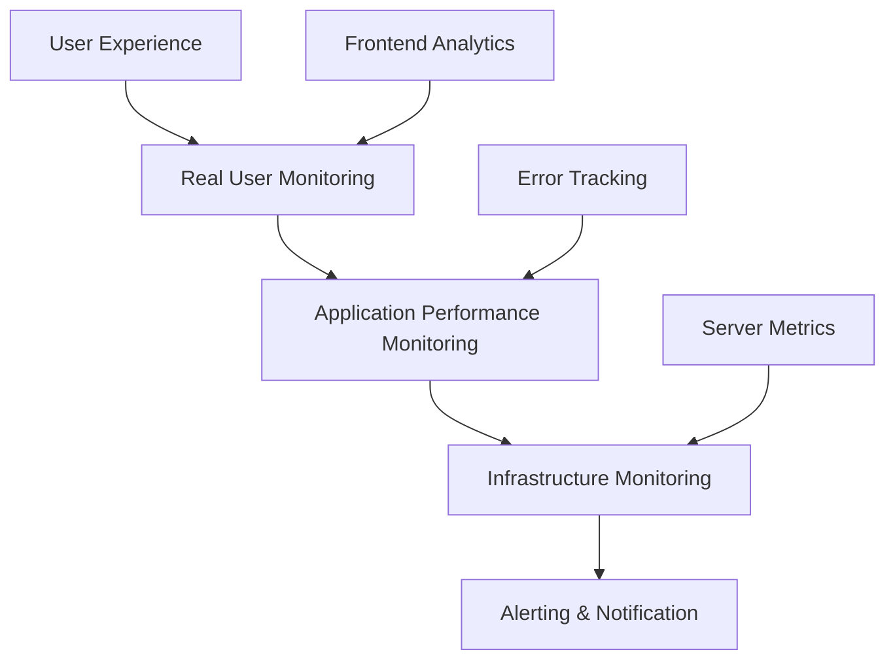

---

id: performance-monitoring-production
title: Comprehensive Performance Monitoring for Production Applications
slug: performance-monitoring-production
excerpt: Build a complete performance monitoring system with APM, Real User Monitoring, server metrics, and automated alerting to ensure optimal application performance in production.
author: Bradley R. Clampitt
date: 2024-12-10
category: devops
tags: ["Performance", "Monitoring", "APM", "DevOps"]
featured: false
readTime: "13 min read"
---

# Comprehensive Performance Monitoring for Production Applications

Effective performance monitoring is crucial for maintaining optimal user experiences in production environments. This comprehensive guide covers building a complete monitoring system that spans from user interactions to infrastructure metrics.

## Monitoring Architecture Overview

A robust performance monitoring system includes multiple layers:



## Real User Monitoring (RUM)

### Core Web Vitals Implementation

```javascript
// Core Web Vitals with Performance Observer API
class WebVitalsMonitor {
  constructor() {
    this.metrics = {}
    this.init()
  }
  
  init() {
    this.measureFCP()  // First Contentful Paint
    this.measureLCP()  // Largest Contentful Paint
    this.measureFID()  // First Input Delay
    this.measureCLS()  // Cumulative Layout Shift
    this.measureTTFB() // Time to First Byte
  }
  
  measureFCP() {
    if (PerformanceObserver.supportedEntryTypes.includes('paint')) {
      const observer = new PerformanceObserver((entryList) => {
        const entries = entryList.getEntries()
        entries.forEach(entry => {
          if (entry.name === 'first-contentful-paint') {
            this.metrics.fcp = entry.startTime
            this.reportMetric('fcp', entry.startTime)
          }
        })
      })
      observer.observe({ entryTypes: ['paint'] })
    }
  }
  
  measureLCP() {
    if (PerformanceObserver.supportedEntryTypes.includes('largest-contentful-paint')) {
      const observer = new PerformanceObserver((entryList) => {
        const entries = entryList.getEntries()
        const lastEntry = entries[entries.length - 1]
        this.metrics.lcp = lastEntry.startTime
        this.reportMetric('lcp', lastEntry.startTime)
      })
      observer.observe({ entryTypes: ['largest-contentful-paint'] })
    }
  }
  
  measureFID() {
    if (PerformanceObserver.supportedEntryTypes.includes('first-input')) {
      const observer = new PerformanceObserver((entryList) => {
        const firstInput = entryList.getEntries()[0]
        const fid = firstInput.processingStart - firstInput.startTime
        this.metrics.fid = fid
        this.reportMetric('fid', fid)
      })
      observer.observe({ entryTypes: ['first-input'] })
    }
  }
  
  measureCLS() {
    if (PerformanceObserver.supportedEntryTypes.includes('layout-shift')) {
      let clsValue = 0
      const observer = new PerformanceObserver((entryList) => {
        const entries = entryList.getEntries()
        
        entries.forEach(entry => {
          if (!entry.hadRecentInput) {
            clsValue += entry.value
          }
        })
        
        this.metrics.cls = clsValue
        this.reportMetric('cls', clsValue)
      })
      observer.observe({ entryTypes: ['layout-shift'] })
    }
  }
  
  measureTTFB() {
    if (PerformanceObserver.supportedEntryTypes.includes('navigation')) {
      const observer = new PerformanceObserver(navObserver)
      observer.observe({ entryTypes: ['navigation'] })
      
      function navObserver(entryList) {
        const navigationEntry = entryList.getEntries()[0]
        const ttfb = navigationEntry.responseStart - navigationEntry.requestStart
        this.metrics.ttfb = ttfb
        this.reportMetric('ttfb', ttfb)
      }
    }
  }
  
  reportMetric(name, value) {
    // Send to analytics service
    console.log(`${name}: ${value}ms`)
    
    // Example: Send to custom endpoint
    fetch('/api/metrics', {
      method: 'POST',
      headers: { 'Content-Type': 'application/json' },
      body: JSON.stringify({
        metric: name,
        value: value,
        timestamp: Date.now(),
        userAgent: navigator.userAgent,
        url: window.location.href
      })
    })
  }
}

// Initialize monitoring
new WebVitalsMonitor()
```

### Resource Performance Tracking

```javascript
// Advanced resource monitoring
class ResourceMonitor {
  constructor() {
    this.resourceMetrics = []
    this.initResourceTracking()
  }
  
  initResourceTracking() {
    // Monitor resource timing
    if (PerformanceObserver.supportedEntryTypes.includes('resource')) {
      const observer = new PerformanceObserver((entryList) => {
        entryList.getEntries().forEach(entry => this.analyzeResource(entry))
      })
      observer.observe({ entryTypes: ['resource'] })
    }
  }
  
  analyzeResource(entry) {
    const resource = {
      name: entry.name,
      type: entry.initiatorType,
      duration: entry.duration,
      size: entry.transferSize,
      startTime: entry.startTime,
      connectTime: entry.connectEnd - entry.connectStart,
      dnsTime: entry.domainLookupEnd - entry.domainLookupStart,
      ttfb: entry.responseStart - entry.requestStart
    }
    
    // Identify slow resources
    if (resource.duration > 1000) {
      this.reportSlowResource(resource)
    }
    
    // Identify large resources
    if (resource.size > 500000) { // 500KB
      this.reportLargeResource(resource)
    }
    
    this.resourceMetrics.push(resource)
  }
  
  reportSlowResource(resource) {
    console.warn('Slow resource detected:', resource)
    
    // Send alert for slow resources
    this.sendAlert({
      type: 'slow_resource',
      resource: resource,
      threshold: 1000
    })
  }
  
  reportLargeResource(resource) {
    console.warn('Large resource detected:', resource)
    
    // Send alert for large resources
    this.sendAlert({
      type: 'large_resource',
      resource: resource,
      threshold: 500000
    })
  }
  
  sendAlert(alertData) {
    fetch('/api/alerts', {
      method: 'POST',
      headers: { 'Content-Type': 'application/json' },
      body: JSON.stringify(alertData)
    })
  }
}

new ResourceMonitor()
```

## Application Performance Monitoring (APM)

### Custom Performance Instrumentation

```javascript
// Custom APM implementation
class APMInstrumentation {
  constructor() {
    this.spans = new Map()
    this.traces = []
    this.init()
  }
  
  init() {
    // Instrument XMLHttpRequest
    this.instrumentXHR()
    
    // Instrument Fetch API
    this.instrumentFetch()
    
    // Instrument timer functions
    this.instrumentTimers()
  }
  
  instrumentXHR() {
    const originalOpen = XMLHttpRequest.prototype.open
    const originalSend = XMLHttpRequest.prototype.send
    
    XMLHttpRequest.prototype.open = function(method, url, ...args) {
      this.APM_method = method
      this.APM_url = url
      this.APM_startTime = performance.now()
      return originalOpen.call(this, method, url, ...args)
    }
    
    XMLHttpRequest.prototype.send = function(...args) {
      const xhr = this
      
      xhr.addEventListener('load', function() {
        const duration = performance.now() - xhr.APM_startTime
        const span = {
          type: 'http',
          method: xhr.APM_method,
          url: xhr.APM_url,
          duration: duration,
          status: xhr.status,
          timestamp: Date.now()
        }
        
        APMInstrumentation.instance.reportSpan(span)
      })
      
      xhr.addEventListener('error', function() {
        const duration = performance.now() - xhr.APM_startTime
        const span = {
          type: 'http_error',
          method: xhr.APM_method,
          url: xhr.APM_url,
          duration: duration,
          status: xhr.status,
          error: 'Network error',
          timestamp: Date.now()
        }
        
        APMInstrumentation.instance.reportSpan(span)
      })
      
      return originalSend.call(this, ...args)
    }
  }
  
  instrumentFetch() {
    const originalFetch = window.fetch
    
    window.fetch = function(url, options = {}) {
      const startTime = performance.now()
      const method = options.method || 'GET'
      
      return originalFetch(url, options).then(response => {
        const duration = performance.now() - startTime
        const span = {
          type: 'fetch',
          method: method,
          url: url,
          duration: duration,
          status: response.status,
          timestamp: Date.now()
        }
        
        APMInstrumentation.instance.reportSpan(span)
        return response
      }).catch(error => {
        const duration = performance.now() - startTime
        const span = {
          type: 'fetch_error',
          method: method,
          url: url,
          duration: duration,
          error: error.message,
          timestamp: Date.now()
        }
        
        APMInstrumentation.instance.reportSpan(span)
        throw error
      })
    }
  }
  
  instrumentTimers() {
    const originalSetTimeout = window.setTimeout
    const originalSetInterface = window.setInterface
    
    window.setTimeout = function(func, delay, ...args) {
      const startTime = performance.now()
      
      return originalSetTimeout(function() {
        const duration = performance.now() - startTime
        APMInstrumentation.instance.reportTimer('setTimeout', duration, delay)
        return func.apply(this, args)
      }, delay)
    }
  }
  
  startSpan(name, tags = {}) {
    const spanId = Math.random().toString(36).substr(2, 9)
    const span = {
      id: spanId,
      name: name,
      startTime: Date.now(),
      tags: tags,
      children: []
    }
    
    this.spans.set(spanId, span)
    return spanId
  }
  
  finishSpan(spanId, tags = {}) {
    const span = this.spans.get(spanId)
    if (!span) return
    
    span.endTime = Date.now()
    span.duration = span.endTime - span.startTime
    span.tags = { ...span.tags, ...tags }
    
    this.reportSpan(span)
    this.spans.delete(spanId)
  }
  
  reportSpan(span) {
    // Send to APM backend
    console.log('APM Span:', span)
    
    fetch('/api/apm/spans', {
      method: 'POST',
      headers: { 'Content-Type': 'application/json' },
      body: JSON.stringify(span)
    }).catch(err => console.error('APM reporting error:', err))
  }
  
  reportTimer(type, actualDuration, expectedDuration) {
    if (actualDuration > expectedDuration * 2) {
      console.warn(`Slow timer: ${type} expected ${expectedDuration}ms, took ${actualDuration}ms`)
      
      this.sendAlert({
        type: 'slow_timer',
        timerType: type,
        actualDuration,
        expectedDuration,
        deviation: actualDuration - expectedDuration
      })
    }
  }
  
  static instance = new this()
}

// Initialize APM
APMInstrumentation.instance
```

## Server-Side Monitoring

### Node.js/Express Performance Tracking

```javascript
// Express.js performance middleware
const express = require('express')
const app = express()

// Custom performance middleware
function performanceMiddleware(req, res, next) {
  const startTime = process.hrtime.bigint()
  const startMemory = process.memoryUsage()
  
  // Override res.end to capture response metrics
  const originalEnd = res.end
  res.end = function(chunk, encoding) {
    const endTime = process.hrtime.bigint()
    const requestDuration = Number(endTime - startTime) / 1e6 // Convert to milliseconds
    
    const endMemory = process.memoryUsage()
    const memoryUsage = {
      rss: endMemory.rss - startMemory.rss,
      heapUsed: endMemory.heapUsed - startMemory.heapUsed,
      heapTotal: endMemory.heapTotal - startMemory.heapTotal,
      external: endMemory.external - startMemory.external
    }
    
    const metrics = {
      timestamp: Date.now(),
      method: req.method,
      url: req.originalUrl,
      statusCode: res.statusCode,
      duration: requestDuration,
      memoryUsage: memoryUsage,
      userAgent: req.get('User-Agent'),
      ip: req.ip,
      contentLength: res.get('Content-Length') || 0
    }
    
    // Report metrics
    reportServerMetrics(metrics)
    
    // Call original end method
    originalEnd.call(this, chunk, encoding)
  }
  
  next()
}

function reportServerMetrics(metrics) {
  // Log slow requests
  if (metrics.duration > 1000) {
    console.warn(`Slow request detected: ${metrics.method} ${metrics.url} took ${metrics.duration}ms`)
  }
  
  // Send to monitoring service
  sendToMonitoringService('server_metrics', metrics)
}

// Memory leak detection
function detectMemoryLeaks() {
  setInterval(() => {
    const memUsage = process.memoryUsage()
    const heapUsedMB = memUsage.heapUsed / 1024 / 1024
    
    // Alert if heap usage exceeds 500MB
    if (heapUsedMB > 500) {
      console.error(`Memory leak detected! Heap usage: ${heapUsedMB.toFixed(2)}MB`)
      
      sendToMonitoringService('memory_leak', {
        timestamp: Date.now(),
        heapUsed: memUsage.heapUsed,
        heapTotal: memUsage.heapTotal,
        rss: memUsage.rss,
        external: memUsage.external
      })
    }
  }, 30000) // Check every 30 seconds
}

app.use(performanceMiddleware)
detectMemoryLeaks()
```

### Database Performance Monitoring

```javascript
// Database query performance monitoring
class DatabaseMonitor {
  constructor(dbConnection) {
    this.db = dbConnection
    this.queryMetrics = []
    this.slowQueryThreshold = 1000 // 1 second
    
    this.instrumentQueries()
  }
  
  instrumentQueries() {
    const originalQuery = this.db.query.bind(this.db)
    
    this.db.query = function(sql, params, callback) {
      const startTime = performance.now()
      const queryId = Math.random().toString(36).substr(2, 9)
      
      const sqlQuery = params ? this.format(sql, params) : sql
      
      const wrappedCallback = function(error, results) {
        const duration = performance.now() - startTime
        const metrics = {
          id: queryId,
          sql: sqlQuery,
          duration: duration,
          timestamp: Date.now(),
          error: error ? error.message : null,
          rowCount: results ? results.length : 0
        }
        
        // Log slow queries
        if (duration > this.slowQueryThreshold) {
          console.warn(`Slow query detected:`, metrics)
        }
        
        // Store metrics
        this.queryMetrics.push(metrics)
        
        // Keep only last 1000 queries to prevent memory issues
        if (this.queryMetrics.length > 1000) {
          this.queryMetrics.shift()
        }
        
        // Report critical issues
        this.reportQueryMetrics(metrics)
        
        // Call original callback
        if (callback) callback(error, results)
      }
      
      return originalQuery(sql, params, wrappedCallback)
    }
  }
  
  reportQueryMetrics(metrics) {
    // Send slow queries to monitoring service
    if (metrics.duration > this.slowQueryThreshold) {
      fetch('/api/monitoring/slow-queries', {
        method: 'POST',
        headers: { 'Content-Type': 'application/json' },
        body: JSON.stringify(metrics)
      })
    }
    
    // Send error queries
    if (metrics.error) {
      fetch('/api/monitoring/query-errors', {
        method: 'POST',
        headers: { 'Content-Type': 'application/json' },
        body: JSON.stringify(metrics)
      })
    }
  }
  
  getQueryStats() {
    const now = Date.now()
    const last5Minutes = this.queryMetrics.filter(m => 
      now - m.timestamp < 300000
    )
    
    return {
      totalQueries: last5Minutes.length,
      averageDuration: last5Minutes.reduce((sum, m) => sum + m.duration, 0) / last5Minutes.length,
      slowQueries: last5Minutes.filter(m => m.duration > this.slowQueryThreshold).length,
      errorCount: last5Minutes.filter(m => m.error).length
    }
  }
}
```

## Automated Alerting System

### Alert Configuration

```javascript
// Comprehensive alerting system
class AlertEngine {
  constructor() {
    this.alerts = []
    this.rules = new Map()
    this.alertChannels = new Map()
    
    this.loadAlertRules()
    this.setupAlertChannels()
  }
  
  loadAlertRules() {
    // Performance rules
    this.addRule('slow_page_load', {
      condition: (data) => data.type === 'page_load' && data.duration > 3000,
      severity: 'warning',
      message: 'Slow page load detected'
    })
    
    this.addRule('high_error_rate', {
      condition: (data) => data.errorRate > 0.05, // 5% error rate
      severity: 'critical',
      message: 'High error rate detected'
    })
    
    this.addRule('memory_leak', {
      condition: (data) => data.type === 'memory' && data.heapUsed > 500 * 1024 * 1024,
      severity: 'critical',
      message: 'Memory leak detected'
    })
    
    this.addRule('slow_database_query', {
      condition: (data) => data.type === 'db_query' && data.duration > 2000,
      severity: 'warning',
      message: 'Slow database query detected'
    })
  }
  
  addRule(name, rule) {
    this.rules.set(name, rule)
  }
  
  setupAlertChannels() {
    // Email channel
    this.alertChannels.set('email', (alert) => {
      this.sendEmail(alert)
    })
    
    // Slack channel
    this.alertChannels.set('slack', (alert) => {
      this.sendSlackMessage(alert)
    })
    
    // PagerDuty channel
    this.alertChannels.set('pagerduty', (alert) => {
      this.sendPagerDuty(alert)
    })
  }
  
  evaluate(data) {
    for (const [ruleName, rule] of this.rules) {
      if (rule.condition(data)) {
        this.createAlert(ruleName, rule, data)
      }
    }
  }
  
  createAlert(ruleName, rule, data) {
    const alert = {
      id: Math.random().toString(36).substr(2, 9),
      rule: ruleName,
      severity: rule.severity,
      message: rule.message,
      data: data,
      timestamp: Date.now(),
      acknowledged: false
    }
    
    this.alerts.push(alert)
    
    // Send to appropriate channels
    this.sendAlert(alert)
    
    // Cleanup old alerts (keep last 100)
    if (this.alerts.length > 100) {
      this.alerts.shift()
    }
  }
  
  sendAlert(alert) {
    // Determine channels based on severity
    const channels = alert.severity === 'critical' 
      ? ['slack', 'email', 'pagerduty']
      : ['slack', 'email']
    
    channels.forEach(channelName => {
      const channel = this.alertChannels.get(channelName)
      if (channel) {
        channel(alert)
      }
    })
  }
  
  async sendEmail(alert) {
    const emailData = {
      to: 'devops@company.com',
      subject: `Alert: ${alert.message}`,
      body: `
        <h2>Performance Alert</h2>
        <p><strong>Rule:</strong> ${alert.rule}</p>
        <p><strong>Severity:</strong> ${alert.severity}</p>
        <p><strong>Message:</strong> ${alert.message}</p>
        <p><strong>Timestamp:</strong> ${new Date(alert.timestamp).toISOString()}</p>
        <pre>${JSON.stringify(alert.data, null, 2)}</pre>
      `
    }
    
    try {
      await fetch('/api/alerts/email', {
        method: 'POST',
        headers: { 'Content-Type': 'application/json' },
        body: JSON.stringify(emailData)
      })
    } catch (error) {
      console.error('Email alert failed:', error)
    }
  }
  
  async sendSlackMessage(alert) {
    const slackPayload = {
      channel: '#alerts',
      text: `🚨 ${alert.message}`,
      attachments: [{
        color: alert.severity === 'critical' ? 'danger' : 'warning',
        fields: [
          {
            title: 'Rule',
            value: alert.rule,
            short: true
          },
          {
            title: 'Severity',
            value: alert.severity,
            short: true
          },
          {
            title: 'Timestamp',
            value: new Date(alert.timestamp).toISOString(),
            short: false
          }
        ]
      }]
    }
    
    try {
      await fetch('/api/alerts/slack', {
        method: 'POST',
        headers: { 'Content-Type': 'application/json' },
        body: JSON.stringify(slackPayload)
      })
    } catch (error) {
      console.error('Slack alert failed:', error)
    }
  }
}

const alertEngine = new AlertEngine()
```

## Dashboard and Visualization

### Real-time Performance Dashboard

```html
<!-- Performance Dashboard -->
<div class="performance-dashboard">
  <div class="metrics-grid">
    
    <!-- Core Web Vitals -->
    <div class="metric-card">
      <haeder>
        <h3>Core Web Vitals</h3>
      </header>
      <div class="metrics">
        <div class="metric">
          <span class="label">LCP</span>
          <span class="value" data-metric="lcp">Loading...</span>
        </div>
        <div class="metric">
          <span class="label">FID</span>
          <span class="value" data-metric="fid">Loading...</span>
        </div>
        <div class="metric">
          <span class="label">CLS</span>
          <span class="value" data-metric="cls">Loading...</span>
        </div>
      </div>
    </div>
    
    <!-- Error Rate -->
    <div class="metric-card">
      <haeder>
        <h3>Error Rate</h3>
      </header>
      <div class="error-rate-chart" data-chart="error-rate"></div>
    </div>
    
    <!-- Response Times -->
    <div class="metric-card">
      <haeder>
        <h3>Response Times</h3>
      </header>
      <div class="response-time-chart" data-chart="response-times"></div>
    </div>
    
    <!-- Server Resources -->
    <div class="metric-card">
      <haeder>
        <h3>Server Resources</h3>
      </header>
      <div class="metrics">
        <div class="metric">
          <span class="label">CPU</span>
          <span class="value" data-metric="cpu">Loading...</span>
        </div>
        <div class="metric">
          <span class="label">Memory</span>
          <span class="value" data-metric="memory">Loading...</span>
        </div>
      </div>
    </div>
    
  </div>
</div>

<script>
// Dashboard updates
class PerformanceDashboard {
  constructor() {
    this.initDashboard()
    this.startRealTimeUpdates()
  }
  
  initDashboard() {
    // Initialize charts
    this.createCharts()
    this.loadInitialData()
  }
  
  startRealTimeUpdates() {
    // Update every 5 seconds
    setInterval(() => {
      this.updateMetrics()
    }, 5000)
    
    // WebSocket connection for real-time updates
    this.connectWebSocket()
  }
  
  async updateMetrics() {
    try {
      const response = await fetch('/api/metrics/dashboard')
      const data = await response.json()
      
      this.updateWebVitals(data.webVitals)
      this.updateServerMetrics(data.server)
      this.updateCharts(data.charts)
    } catch (error) {
      console.error('Dashboard update failed:', error)
    }
  }
  
  updateWebVitals(metrics) {
    Object.entries(metrics).forEach(([name, value]) => {
      const element = document.querySelector(`[data-metric="${name}"]`)
      if (element) {
        element.textContent = value.toFixed(2)
        element.className = `value ${this.getVitalStatus(name, value)}`
      }
    })
  }
  
  getVitalStatus(name, value) {
    const thresholds = {
      lcp: { good: 2500, poor: 4000 },
      fid: { good: 100, poor: 300 },
      cls: { good: 0.1, poor: 0.25 }
    }
    
    const threshold = thresholds[name]
    if (value <= threshold.good) return 'good'
    if (value <= threshold.poor) return 'needs-improvement'
    return 'poor'
  }
  
  connectWebSocket() {
    const ws = new WebSocket('ws://localhost:8080/dashboard')
    
    ws.onmessage = (event) => {
      const data = JSON.parse(event.data)
      if (data.type === 'metric') {
        this.updateRealTimeMetric(data)
      } else if (data.type === 'alert') {
        this.showAlert(data)
      }
    }
    
    ws.onerror = (error) => {
      console.error('WebSocket error:', error)
    }
  }
}

new PerformanceDashboard()
</script>
```

## Testing and Optimization

### Performance Testing Strategy

```javascript
// Automated performance testing
class PerformanceTest {
  constructor() {
    this.testResults = []
    this.benchmarks = new Map()
  }
  
  async runPerformanceTests() {
    const tests = [
      { name: 'page_load_time', test: this.testPageLoad.bind(this) },
      {name: 'api_response_time', test: this.testAPIResponse.bind(this) },
      { name: 'database_query_performance', test: this.testDBQueries.bind(this) },
      { name: 'memory_usage', test: this.testMemoryUsage.bind(this) }
    ]
    
    for (const test of tests) {
      try {
        const result = await test.test()
        this.testResults.push({
          name: test.name,
          result: result,
          timestamp: Date.now(),
          passed: result.status === 'pass'
        })
      } catch (error) {
        this.testResults.push({
          name: test.name,
          result: { status: 'fail', error: error.message },
          timestamp: Date.now(),
          passed: false
        })
      }
    }
    
    return this.testResults
  }
  
  async testPageLoad() {
    const startTime = performance.now()
    
    try {
      const response = await fetch('/test-page')
      await response.text()
      
      const loadTime = performance.now() - startTime
      
      if (loadTime > 2000) {
        return { status: 'fail', message: `Page load too slow: ${loadTime}ms` }
      }
      
      return { status: 'pass', loadTime: loadTime }
    } catch (error) {
      return { status: 'fail', message: error.message }
    }
  }
  
  async testAPIResponse() {
    const endpoints = [
      '/api/users',
      '/api/products',
      '/api/orders'
    ]
    
    const results = []
    
    for (const endpoint of endpoints) {
      const startTime = performance.now()
      
      try {
        const response = await fetch(endpoint)
        
        if (!response.ok) {
          results.push({ endpoint, status: 'fail', message: `HTTP ${response.status}` })
          continue
        }
        
        const responseTime = performance.now() - startTime
        
        if (responseTime > 500) {
          results.push({ endpoint, status: 'warn', responseTime })
        } else {
          results.push({ endpoint, status: 'pass', responseTime })
        }
      } catch (error) {
        results.push({ endpoint, status: 'fail', message: error.message })
      }
    }
    
    return { totalEndpoints: endpoints.length, results }
  }
}

// Run tests every hour
setInterval(async () => {
  const testSuite = new PerformanceTest()
  const results = await testSuite.runPerformanceTests()
  
  console.log('Performance test results:', results)
  
  // Send results to monitoring service
  fetch('/api/monitoring/test-results', {
    method: 'POST',
    headers: { 'Content-Type': 'application/json' },
    body: JSON.stringify(results)
  })
}, 3600000) // 1 hour
```

## Best Practices Summary

### Implementation Guidelines

1. **Start Simple**: Begin with basic monitoring and gradually add complexity
2. **Monitor Everything**: Track both frontend and backend performance metrics
3. **Set Reasonable Thresholds**: Configure alerts based on realistic expectations
4. **Test Monitoring**: Regularly validate that monitoring systems are working
5. **Plan for Scale**: Design monitoring systems to handle growth

### Performance Optimization Tips

1. **Resource Optimization**: Optimize images, scripts, and stylesheets
2. **Caching Strategy**: Implement effective caching at all levels
3. **Database Optimization**: Monitor and optimize database queries
4. **CDN Usage**: Leverage Content Delivery Networks for global performance
5. **Progressive Loading**: Implement lazy loading and progressive enhancement

> **Pro Tip:** Focus on measuring what matters most to your users—perceived performance and Core Web Vitals—rather than getting lost in technical metrics that don't correlate with user experience.

## Conclusion

Comprehensive performance monitoring is essential for maintaining optimal application performance and user experience. By implementing robust monitoring systems that span the entire technology stack—from user interactions to infrastructure metrics—you can proactively identify and resolve performance issues before they impact users.

Regular testing, continuous optimization, and automated alerting ensure that your applications perform consistently well as they grow and evolve.
